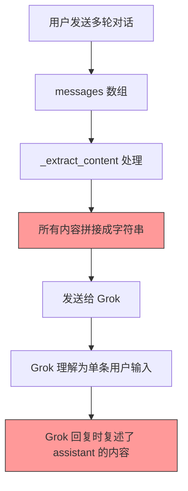

# Grok 上下文重复问题解决方案

## 问题概述

### 问题现象
在使用 Grok2API 进行多轮对话时，AI 的回复会**重复之前的对话内容**。例如：

**用户对话**：
```
用户: 你好
助手: 你好！今天感觉怎么样？
用户: 今天是啥日子？
助手: 你好你好！...今天是2026年1月1日... (重复了"你好")
```

### 问题根源

#### 1. Grok Web API 的特殊设计

Grok Web API 与标准 Chat API（OpenAI/Claude）有本质区别：

| 特性 | OpenAI/Claude API | Grok Web API |
|------|-------------------|--------------|
| 消息格式 | `messages` 数组 | 单个 `message` 字符串 |
| 多轮对话 | API 原生支持 | 每次都是新会话 |
| 端点 | `/v1/chat/completions` | `/rest/app-chat/conversations/new` |
| 设计目的 | 开发者 API | 浏览器前端 |

**Grok 请求体示例**：
```json
{
  "message": "单条字符串文本",
  "temporary": true,
  "modelName": "grok-3"
}
```

#### 2. 代码实现的妥协

为了兼容 OpenAI 格式，[`client.py:98-115`](../app/services/grok/client.py) 的 `_extract_content()` 函数将所有消息拼接成一条：

```python
def _extract_content(messages: List[Dict]) -> Tuple[str, List[str]]:
    texts, images = [], []
    for msg in messages:  # 遍历所有消息（不区分角色）
        content = msg.get("content", "")
        texts.append(content)  # 全部拼接
    return "".join(texts), images  # 合并成一条发送
```

#### 3. 重复的产生过程



**实际发送给 Grok 的内容**：
```
"我叫张三" + "你好，张三！" + "我叫什么"
= "我叫张三你好，张三！我叫什么"
```

Grok 将 assistant 说过的话也当成了用户输入的一部分，因此会在回复中重复。

---

## 解决方案：角色标注法（改进版）

### 核心思路

在拼接消息时，明确标注每条消息的角色身份，并区分历史消息和当前问题，让 Grok 理解对话结构。

### 代码实现

修改 [`app/services/grok/client.py`](../app/services/grok/client.py) 中的 `_extract_content()` 函数：

```python
@staticmethod
def _extract_content(messages: List[Dict]) -> Tuple[str, List[str]]:
    """提取文本和图片 - 格式化多轮对话（改进版）"""
    parts, images = [], []
    
    # 是否有多条消息（需要格式化）
    need_format = len(messages) > 1
    
    for i, msg in enumerate(messages):
        role = msg.get("role", "user")
        content = msg.get("content", "")
        
        # 处理多模态内容
        if isinstance(content, list):
            text_parts = []
            for item in content:
                if item.get("type") == "text":
                    text_parts.append(item.get("text", ""))
                elif item.get("type") == "image_url":
                    if url := item.get("image_url", {}).get("url"):
                        images.append(url)
            content = "".join(text_parts)
        
        if not content.strip():
            continue
        
        # 单条消息不需要格式化
        if not need_format:
            parts.append(content)
        else:
            # 多条消息需要格式化
            is_last = (i == len(messages) - 1)
            
            if role == "system":
                parts.append(f"[系统指令]: {content}")
            elif role == "user":
                if is_last:
                    parts.append(f"[当前问题]: {content}")
                else:
                    parts.append(f"[历史用户消息]: {content}")
            elif role == "assistant":
                parts.append(f"[历史AI回复]: {content}")
    
    # 添加指导语（仅多轮对话）
    if need_format:
        parts.append("\n[注意：请根据以上对话历史回答当前问题，不要重复历史回复中的内容。]")
    
    return "\n".join(parts), images
```

### 改进点说明

1. **区分历史和当前消息**：最后一条用户消息标记为 `[当前问题]`
2. **明确历史属性**：历史消息标记为 `[历史用户消息]` 和 `[历史AI回复]`
3. **添加中文指导语**：明确告诉 Grok 不要重复历史内容
4. **单消息优化**：只有一条消息时不添加标记，保持简洁

### 预期效果

**发送给 Grok 的内容**：
```
[历史用户消息]: 我叫张三
[历史AI回复]: 你好，张三！很高兴认识你
[当前问题]: 我叫什么名字

[注意：请根据以上对话历史回答当前问题，不要重复历史回复中的内容。]
```

**Grok 预期回复**：
```
你叫张三。
```

---

## 执行步骤

### 环境信息

| 项目 | 路径/值 |
|------|---------|
| 源码目录 | `/root/YData/github/grok2api` |
| 部署目录 | `/opt/grok2api` |
| 修改文件 | `app/services/grok/client.py` |
| 镜像名称 | `grok2api:1.3.1-fix` |

### 第一步：修改代码

```bash
# 进入源码目录
cd /root/YData/github/grok2api

# 编辑 client.py 文件
vi app/services/grok/client.py

# 找到 _extract_content 函数（约第 98 行）
# 替换为上述改进版代码
```

### 第二步：构建 Docker 镜像

#### 关于 Docker Build 代理

**重要**：`docker pull` 和 `docker build` 使用的代理机制不同！

| 操作 | 代理来源 |
|------|---------|
| `docker pull` | Docker Daemon 代理 |
| `docker build` 基础镜像（传统构建器） | Docker Daemon 代理 |
| `docker build` 基础镜像（BuildKit） | BuildKit 配置（默认不继承 Daemon 代理） |
| `docker build` 容器内 RUN 命令 | 需要 `--build-arg` 显式指定 |

如果你已配置 Docker Daemon 代理但 `docker build` 失败，说明 **BuildKit 没有正确使用代理**。

#### 解决方案：禁用 BuildKit

使用 `DOCKER_BUILDKIT=0` 强制使用传统构建器，继承 Daemon 代理：

```bash
cd /root/YData/github/grok2api

# 使用传统构建器（推荐）
DOCKER_BUILDKIT=0 docker build -t grok2api:1.3.1-fix .

# 构建成功后显示：
# Successfully built xxxxxxxxx
# Successfully tagged grok2api:1.3.1-fix
```

#### 验证镜像

```bash
docker images | grep grok
# 应该看到：
# grok2api  1.3.1-fix  xxxxxxxxx  刚刚  80.1MB
```

### 第三步：部署新镜像

```bash
# 1. 进入部署目录
cd /opt/grok2api

# 2. 停止旧容器
docker compose down

# 3. 修改 docker-compose.yml
vi docker compose.yml

# 将第 3 行：
#   image: ghcr.io/chenyme/grok2api:latest
# 改为：
#   image: grok2api:1.3.1-fix

# 4. 启动新容器
docker compose up -d

# 5. 查看日志确认启动成功
docker compose logs -f
```

### 第四步：测试验证

```bash
# 测试多轮对话
curl -s http://docker:7862/v1/chat/completions \
  -H "Content-Type: application/json" \
  -H "Authorization: Bearer 9783" \
  -d '{
    "model": "grok-4.1",
    "messages": [
      {"role": "user", "content": "我叫张三"},
      {"role": "assistant", "content": "你好，张三！"},
      {"role": "user", "content": "我叫什么名字"}
    ],
    "stream": false
  }' | jq -r '.choices[0].message.content'

# 预期输出：只回答"你叫张三"，不重复"你好，张三"
```

---

## 后续维护

### 版本管理

| 版本 | 说明 |
|------|------|
| `ghcr.io/chenyme/grok2api:latest` | 原始版本 |
| `grok2api:1.3.1-fix` | 修复上下文重复问题 |

### 原作者更新时

如果原作者发布新版本，需要手动合并代码：

```bash
cd /root/YData/github/grok2api

# 备份修改
git stash

# 拉取更新
git pull origin main

# 应用修改
git stash pop

# 解决冲突（如果有）
# 重新构建
DOCKER_BUILDKIT=0 docker build -t grok2api:1.3.1-fix .
```

---

## 测试清单

- [x] 单轮对话正常响应
- [x] 多轮对话不重复历史内容
- [ ] system 消息正确处理
- [ ] 图片上传功能正常
- [ ] 边界情况测试

---

## 结论

Grok 上下文重复问题的**根本原因**是 Grok Web API 的设计与标准 Chat API 不同，它只接受单条消息字符串，不支持 messages 数组。

**解决方案**是采用**角色标注法**，在拼接消息时明确标注角色身份，让 Grok 理解对话结构，从而避免重复。

修复后的镜像：`grok2api:1.3.1-fix`（2026-01-01）
